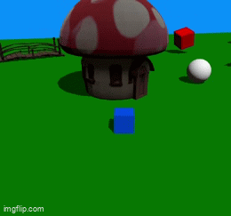

# vibeworld

1. Install Three.js
2. Launch vite
3. Go to http://localhost:5173/
4. Run the websocket server: `python websocket_server.py`

Built with
- Claude
- Three js
- Eleven Labs
- Trellis (via PyTorch)

